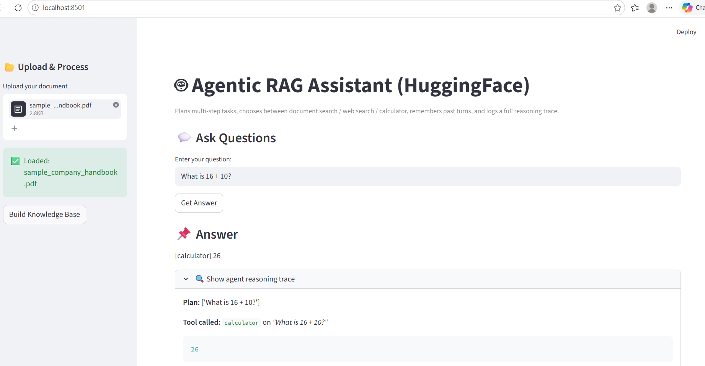

# 🤖 Agentic RAG Assistant (HuggingFace + LangChain)

Retrieval-Augmented Generation (RAG) AI assistant with document upload and
semantic search — upgraded into an **agent** that plans multi-step tasks,
chooses between tools, remembers past turns, and logs a full reasoning
trace for every run.

## 📌 Overview

Upload a document (PDF, DOCX, TXT) and ask questions about it. Unlike a
plain RAG pipeline, this doesn't just retrieve-and-answer in one fixed
pass — it plans, decides which tool to use (documents, web search, or a
calculator), falls back gracefully when one tool comes up empty, and
writes a final answer using an LLM synthesis step.

## 🏗️ Architecture

```
User query
    │
    ▼
Planner ─── splits compound questions into ordered subtasks
    │
    ▼
Router ──── picks a tool per subtask (documents → calculator → web)
    │
    ▼
Tools ────── search_documents | calculator | web_search | summarize
    │
    ▼
Memory ───── short-term conversation buffer + persisted long-term Q&A
    │
    ▼
Synthesis ── FLAN-T5 writes the final answer (deterministic tools like
             the calculator skip this step; a fallback safety net
             catches unusable model output)
    │
    ▼
Trace log ── every step written to /traces/<id>.json
```

### Why this is agentic, not just RAG

The original pipeline was a fixed `query → retrieve → answer` path. This
version adds:

- **Planning** — a compound question like *"what's 18+10 and does the
  handbook mention remote work"* gets split into subtasks and handled
  separately.
- **Tool choice** — the agent decides per subtask whether it needs the
  documents, a calculator, or the web, and falls back automatically if
  one tool doesn't have the answer.
- **Memory** — conversation context carries across turns, and genuinely
  related past questions are recalled (filtered so unrelated past
  questions don't get pulled in by mistake).
- **Observability** — every run is logged to `traces/<trace_id>.json`
  with the plan, every tool call, and the final answer.

## 🚀 Features

- 📂 Upload documents (PDF, DOCX, TXT)
- 🔍 Semantic search using FAISS
- 🧮 Deterministic calculator tool (bypasses the LLM entirely for math)
- 🌐 Web search fallback (DuckDuckGo via `ddgs`, with a Wikipedia API
  fallback if that's rate-limited)
- 🧠 Short-term + long-term memory
- 🤖 AI-powered answer synthesis using FLAN-T5 (HuggingFace) — no API key
  required, with an optional Groq path for higher-quality answers
- 🔍 Expandable reasoning-trace panel in the UI showing the agent's plan,
  tool calls, and results
- ⚡ 8 passing pytest tests covering the planner, router, and calculator

## 🏗️ Tech Stack

- LangChain
- FAISS
- HuggingFace Transformers
- Sentence Transformers
- Streamlit
- `ddgs` (web search) + `requests` (Wikipedia fallback)
- pytest

## ▶️ How to Run

```bash
pip install -r requirements.txt
streamlit run app.py
```

## 🧪 How to Test

```bash
pytest tests/ -v
```

## 📂 Project Structure

```
app.py                      # Streamlit UI, routes questions through the agent
rag_core.py                  # Original RAG logic (FAISS + FLAN-T5)
agent/
  core.py                    # Main plan → act → reflect → synthesize loop
  planner.py                 # Splits compound questions into subtasks
  router.py                  # Picks a tool per subtask
  memory.py                  # Short-term + long-term memory
  llm.py                     # FLAN-T5 answer synthesis (+ optional Groq path)
  prompts.py                 # Synthesis prompt template
tools/
  base.py                    # Tool registry (decorator-based self-registration)
  document_search.py         # Wraps the existing RAG pipeline
  calculator.py               # Sandboxed arithmetic
  web_search.py               # DuckDuckGo + Wikipedia fallback
  summarizer.py               # Compresses long tool output
utils/
  logger.py                   # Writes JSON traces of every agent run
tests/                        # pytest coverage
traces/                       # JSON trace of every run (gitignored)
requirements.txt
```
## 📸 Demo



## 🔥 Future Improvements

- Multi-file upload
- Deployment (AWS / HuggingFace Spaces)
- Swap FLAN-T5 for Groq/Llama by default for stronger answer synthesis
- LLM-based tool routing (see `agent/router.py`'s `choose_tool_llm`) as
  an alternative to the current rule-based router

## 📖 More detail

See the commit history on the `agentic-upgrade` → `main` merge for a
step-by-step build order (tool registry → tools → planner/router →
memory → core agent → LLM synthesis → UI → tests → docs).
